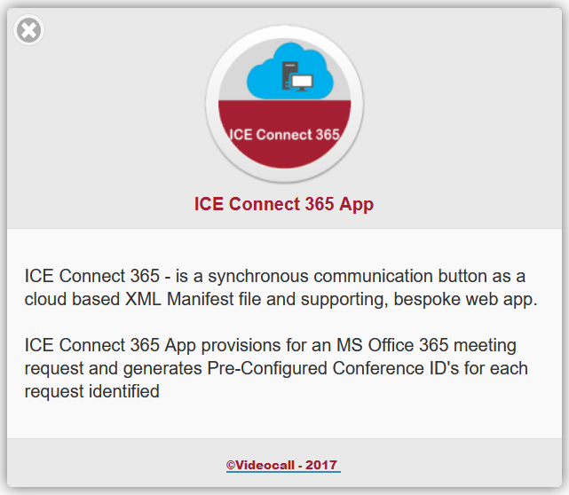

# VideoCall_ICE_Connect_365
ICE Connect 365 App will generate Conference ID's for each NON ON-Premis meeting request.

//'=== J.O. 11-MAY-2017 ====================================================================================================================
//'=== MODULE - ICE_Connect_365_App.exe - (ICE Connect 365 App -  v1.0)
//'===
//'=== AUTHOR - Julius Olatokunbo
//'===
//'=== REASON - Task:
//The Outlook 365 allows for the creation of Skype for Business Meeting Requests to be generated, however
//'without an E5 authentication license there is no Conference ID: displayed.
//'ICE Connect 365 App will generate Conference ID's for each NON ON-Premis meeting request.
//'The New Dashboard Features
//'I've updated the dashboard to include a much more neat and professional layout, as shown below.The dashboard will display your contacts photograph,
//'status Or availability, And their full name. It will also display a link to start an Instant Message with each contact.
//'In the interest of privacy, I've hidden some surnames and photographs from the screenshots below.
//'New Features
//'    Ability to turn on/off logging details
//'    Ability to turn on/off the status Or availability legends (useful to save space on larger dashboards)
//'    Options to exclude off-line contacts (Not much point seeing them normally since you can't interact with them)
//'    Options to sort your contacts in the dashboard.
//'
//'You may be asking, 'Why do we need to sort contacts? Can't Skype do that?' Well, yes and no.Lync or Skype for Business can of course sort your contacts,
//'however the Skype Web SDK returns contacts And presence status asynchronously. This means that it returns contacts As they respond With their status, which
//'isn't necessarily in any particular order.The benefit is that the dashboard builds quickly, the downside is that contacts are rarely in order.
//'Technology Required
//'To use this presence dashboard, all you need Is the SDK's prerequisites installed on your Lync or Skype for Business servers, a web server to host the
//'application, And of course your Lync Or Skype for Business account details.
//'I've used the web framework bootstrap, in order to provide a clean and responsive layout, as well as jQuery, to simplify my JavaScript.
//'This project assumes you have an understanding Of JavaScript And jQuery. If Not, the internet Is full Of great tutorials, Or check out Puralsight.
//'This project doesn't require any server side components, apart from a Lync 2013 or Skype for Business environment that supports the UCWA framework.
//'If don't already have UCWA installed on your environment, pop over here to learn how to install it.
//'Important Prerequisites
//'The Skype Web SDK requires that the UCWA framework Is installed And enabled On your Front-End, Edge And Director servers. Click here To view instructions
//'For how To install UCWA. The Skype Web SDK simply won't function without these steps.
//'The Code
//'The application performs a few basic steps, which are outlined below.
//'
//'    Initialize the SDK
//'    Authenticate with user credentials
//'    Get the user's list of contacts
//'    Subscribe to presence changes for each contact
//'    Logout
//'    Miscellaneous Functions
//'The full code Of For this application Is listed below.
//'The first Step Is To actually initialize the SDK. This requires the inclusion Of the actual SDK In your HTML file, And this Is made very easy As Microsoft
//'conveniently provide this On their CDN.
//'//=== HISTORY-===========================================================================================================================
//'//=== J.O. 27-APR-2017 - v1.0 - Initial flash param loading to establish communication with server, trace output to console
//'//=== J.O. 28-APR-2017 - v1.0 - Alert panel, Logo And Alert Button modification with all text accessed from Locale file
//'//=== J.O. 01-MAY-2017 - v1.0 - Param interpretation
//'//=== J.O. 01-MAY-2017 - v1.0 - Configuring interchangeable css for scalability
//'//=== J.O. 02-MAY-2017 - v1.0 - Configuring Locale messaging for ALL assets, rework CSS, use compile.js
//'//=== J.O. 02-MAY-2017 - v1.0 - determine browser for CBO, And resize scaling
//'//=== J.O. 02-MAY-2017 - v1.0 - determine which CSS according to viewport dimension
//'//=== J.O. 02-MAY-2017 - v1.0 - Ensure AlertPanel.butb opensURL ( _CONST_EOS_MOBILE ) - Ensure we access js/eos_mobile.js, js/eos_slots.js
//'//=== J.O. 02-MAY-2017 - v1.0 - Ensure we apply CSS for <UL><LI> EOS Slot
//'//=== J.O. 11-MAY-2017 ====================================================================================================================
//'=== J.O. 11-MAY-2017 ====================================================================================================================

